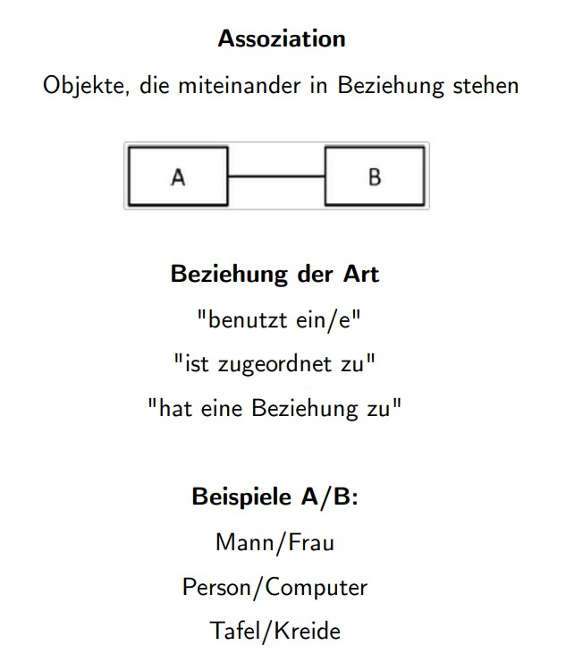
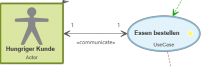

# FSE_Landerer_OO-Analyse

## Objektorientierte Analyse

### Ziele

- Identifizierung von Objekten und deren Eigenschaften: In der OOA geht es darum, die relevanten Objekte in einem System zu identifizieren und ihre Eigenschaften zu beschreiben. Objekte können physisch oder abstrakt sein, wie zum Beispiel ein Auto, ein Benutzerprofil oder ein Datenbank-Management-System.

- Modellierung der Beziehungen zwischen den Objekten: Nachdem die relevanten Objekte identifiziert wurden, muss die Beziehung zwischen diesen Objekten modelliert werden. Diese Beziehungen können verschiedene Formen annehmen, z. B. Vererbung, Aggregation oder Assoziation.

- Festlegung von Anforderungen: Die OOA wird auch verwendet, um Anforderungen an das System festzulegen. Diese Anforderungen werden oft in Form von Szenarien oder Geschichten beschrieben, die beschreiben, wie das System von Benutzern verwendet wird.

- Identifizierung von Geschäftsprozessen: Die OOA kann auch dazu verwendet werden, Geschäftsprozesse zu identifizieren und zu modellieren. Dies hilft bei der Identifizierung von Engpässen oder ineffizienten Prozessen, die verbessert werden können.

- Schaffung einer klaren Struktur des Systems: Durch die Verwendung von Objekten und Beziehungen wird eine klare Struktur des Systems geschaffen, die es Entwicklern erleichtert, das System zu entwerfen und zu implementieren.

- Verbesserung der Wiederverwendbarkeit: Objektorientierte Systeme sind oft modular aufgebaut, was die Wiederverwendbarkeit von Code erhöht. Die OOA kann dazu beitragen, dass diese Module klar definiert und wiederverwendbar sind.

### Requirements Engineering

Requirements Engineering (RE) bezieht sich auf den Prozess der Identifizierung, Analyse, Dokumentation, Validierung und Verwaltung von Anforderungen an ein System. Ziel des RE ist es, sicherzustellen, dass das entwickelte System den Bedürfnissen und Erwartungen der Benutzer entspricht und alle Anforderungen erfüllt werden.

Im Allgemeinen umfasst Requirements Engineering die folgenden Schritte:

- Ermittlung von Anforderungen: In diesem Schritt werden Anforderungen an das System von verschiedenen Stakeholdern wie Kunden, Benutzern, Managern und Entwicklern identifiziert und dokumentiert. Die Anforderungen können funktional (was das System tun soll), nicht funktional (wie das System funktionieren soll) oder regulatorisch (was das System einhalten muss) sein.

- Analyse und Spezifikation von Anforderungen: Hier werden die Anforderungen weiter verfeinert, priorisiert und in eindeutige und verständliche Beschreibungen übersetzt. Dazu gehören auch Diagramme und Modelle, um die Anforderungen besser zu veranschaulichen.

- Validierung von Anforderungen: In diesem Schritt werden die Anforderungen auf Vollständigkeit, Korrektheit, Konsistenz, Verfolgbarkeit und Realisierbarkeit überprüft. Dies hilft, Fehler oder Unklarheiten zu identifizieren, bevor die Entwicklung beginnt.

- Verwaltung von Anforderungen: Hier werden die Anforderungen organisiert, verfolgt und dokumentiert, um sicherzustellen, dass sie im gesamten Entwicklungsprozess konsistent bleiben. Änderungen an den Anforderungen werden überwacht und verwaltet, um sicherzustellen, dass die Auswirkungen auf das System richtig bewertet werden.

Requirements Engineering ist ein kritischer Prozess für den Erfolg eines Softwareprojekts. Durch eine gründliche Analyse und Spezifikation von Anforderungen kann ein System entworfen und entwickelt werden, das den Erwartungen der Benutzer entspricht und ihre Bedürfnisse erfüllt.

### Strukturelle Modellierung

Strukturelle Modellierung bezieht sich auf den Prozess der Erstellung von Modellen, die die statischen Aspekte eines Systems darstellen. Es hilft, die Elemente, die das System ausmachen, zu identifizieren und ihre Beziehungen zu beschreiben. Die Strukturelle Modellierung ist ein wichtiger Bestandteil der Softwareentwicklung, da sie die Grundlage für die Entwicklung von Softwarearchitekturen bildet.

Es gibt verschiedene Arten von strukturellen Modellen, einschließlich:

- Klassendiagramme: Klassendiagramme zeigen die Klassen, Attribute und Methoden einer Softwareanwendung und ihre Beziehungen zueinander.

- Objektdiagramme: Objektdiagramme zeigen die spezifischen Instanzen von Klassen in einer Softwareanwendung und die Beziehungen zwischen ihnen.

- Komponentendiagramme: Komponentendiagramme zeigen die verschiedenen Komponenten einer Softwareanwendung und ihre Abhängigkeiten voneinander.

- Paketdiagramme: Paketdiagramme zeigen die Pakete oder Module einer Softwareanwendung und deren Beziehungen zueinander.

- Verteilungsdiagramme: Verteilungsdiagramme zeigen die physische Verteilung von Komponenten einer Softwareanwendung auf verschiedene Knoten im Netzwerk.

Strukturelle Modelle helfen Entwicklern, ein besseres Verständnis der Komplexität und des Umfangs einer Softwareanwendung zu entwickeln und Probleme in der Architektur zu identifizieren, bevor mit der Implementierung begonnen wird. Sie können auch verwendet werden, um die Wiederverwendbarkeit von Code zu erhöhen und die Wartbarkeit einer Anwendung zu verbessern.

### Dynamische Modellierung

Dynamische Modellierung bezieht sich auf den Prozess der Erstellung von Modellen, die die Verhaltensaspekte eines Systems darstellen. Im Gegensatz zur strukturellen Modellierung, die die statischen Aspekte eines Systems beschreibt, beschreibt die dynamische Modellierung die Interaktionen zwischen den Elementen eines Systems im Laufe der Zeit.

Es gibt verschiedene Arten von dynamischen Modellen, einschließlich:

- Sequenzdiagramme: Sequenzdiagramme zeigen die Interaktionen zwischen Objekten in einer bestimmten Reihenfolge.

- Zustandsdiagramme: Zustandsdiagramme zeigen die verschiedenen Zustände, die ein Objekt im Laufe der Zeit durchläuft, und die Ereignisse, die den Übergang zwischen den Zuständen auslösen.

- Aktivitätsdiagramme: Aktivitätsdiagramme zeigen den Ablauf von Aktivitäten in einer Softwareanwendung und die Beziehungen zwischen ihnen.

- Use-Case-Diagramme: Use-Case-Diagramme zeigen, wie ein Benutzer mit einer Softwareanwendung interagiert und welche Funktionen die Anwendung bereitstellt.

Dynamische Modelle sind hilfreich, um den Ablauf von Prozessen in einer Anwendung zu verstehen und sicherzustellen, dass sie den Anforderungen der Benutzer entsprechen. Sie können auch zur Verifikation und Validierung von Softwareanwendungen verwendet werden, um sicherzustellen, dass sie ordnungsgemäß funktionieren und alle erwarteten Ergebnisse liefern.

### Was ist OOA?

OOA steht für "Objektorientierte Analyse". Es handelt sich um einen Prozess der Softwareentwicklung, der sich auf die Identifizierung und Analyse der Objekte und deren Interaktionen in einem System konzentriert. Im Rahmen der OOA werden die Anforderungen eines Systems aus der Perspektive der Objekte beschrieben, die es ausmachen.

Im Laufe der OOA werden verschiedene Techniken verwendet, um das Verhalten und die Struktur des Systems zu verstehen. Dazu gehören beispielsweise die Erstellung von Use-Case-Diagrammen, die Identifizierung von Objekten und Attributen, die Analyse von Beziehungen zwischen Objekten sowie die Erstellung von Klassendiagrammen.

Ein wichtiger Aspekt der OOA ist die Verwendung von Abstraktion. Indem Entwickler das System auf einer höheren Ebene betrachten und nur die wichtigsten Merkmale identifizieren, können sie eine vereinfachte Darstellung des Systems erstellen, die leichter zu verstehen und zu analysieren ist.

Die OOA bildet auch die Grundlage für die objektorientierte Programmierung (OOP), die darauf abzielt, die Identifizierung von Objekten, die in der OOA beschrieben wurden, in den Programmiercode zu übertragen. Indem Entwickler eine detaillierte Analyse des Systems durchführen, bevor sie mit der Programmierung beginnen, können sie sicherstellen, dass sie eine effektive und effiziente Lösung entwickeln, die den Anforderungen des Systems entspricht.

### Wozu braucht man sie?

- Verbesserte Verständlichkeit: Durch OOA wird das System in kleinere, leichter verständliche Komponenten aufgeteilt. Dies erleichtert die Kommunikation zwischen den Entwicklern und anderen Projektbeteiligten.

- Bessere Wartbarkeit: Eine objektorientierte Modellierung kann die Wartbarkeit des Systems verbessern. Objekte können leichter verändert werden, ohne dass der Rest des Systems beeinträchtigt wird.

- Vermeidung von Fehlern: Durch OOA können potenzielle Fehlerquellen frühzeitig identifiziert und behoben werden. Dadurch wird vermieden, dass Fehler erst in späteren Entwicklungsphasen oder sogar im fertigen Produkt auftreten.

- Wiederverwendbarkeit: Durch die Verwendung von Objekten und Klassen können Teile des Systems wiederverwendet werden. Dadurch kann die Entwicklungszeit reduziert werden und es werden weniger Ressourcen benötigt.

- Bessere Skalierbarkeit: Eine objektorientierte Modellierung kann die Skalierbarkeit des Systems verbessern. Das System kann leichter an die Anforderungen angepasst werden, ohne dass es neu entwickelt werden muss.

### Wie und wann setzt man sie ein?

OOA wird in der Regel in der frühen Phase des Softwareentwicklungsprozesses eingesetzt, um die Anforderungen an das System zu verstehen und in eine objektorientierte Modellierung umzusetzen. Typischerweise wird OOA angewendet, bevor die eigentliche Implementierung des Systems beginnt.

Die folgenden Schritte beschreiben, wie OOA in der Praxis eingesetzt werden kann:

- Anforderungsanalyse: In dieser Phase werden die Anforderungen an das System erfasst und dokumentiert. Dabei werden die funktionalen und nicht-funktionalen Anforderungen an das System ermittelt und beschrieben.

- Modellierung: Auf Basis der Anforderungen wird ein Modell des Systems erstellt. Dabei werden die wichtigsten Entitäten und ihre Beziehungen untereinander identifiziert. Diese Entitäten können in Form von Klassen, Objekten und deren Eigenschaften dargestellt werden.

- Abstraktion: In dieser Phase werden die Modelle weiter verfeinert und abstrahiert. Die Komplexität des Systems wird reduziert, indem irrelevante Details entfernt und nur die wesentlichen Aspekte des Systems modelliert werden.

- Validierung: Das modellierte System wird auf Korrektheit und Vollständigkeit überprüft. Hierbei wird insbesondere darauf geachtet, dass alle Anforderungen erfüllt sind und dass das System in sich konsistent ist.

- Dokumentation: Das modellierte System wird dokumentiert, um den Entwicklungsprozess zu unterstützen und eine einheitliche Basis für die Umsetzung zu schaffen. Die Dokumentation kann sowohl für interne als auch für externe Zwecke genutzt werden.

Um OOA erfolgreich einzusetzen, ist es wichtig, dass alle Projektbeteiligten ein gemeinsames Verständnis von den Anforderungen an das System haben und dass das Modell des Systems klar und verständlich ist. Durch OOA kann die Softwareentwicklung strukturiert und systematisch durchgeführt werden, was die Entwicklung von qualitativ hochwertigen Systemen unterstützt.

## Anforderungsanalyse mit Anwendungsfällen

### Grundlagen

Die Anforderungsanalyse ist ein wichtiger Teil des Software-Entwicklungsprozesses. Es geht darum, die Anforderungen an das zu entwickelnde System zu verstehen, zu dokumentieren und zu spezifizieren. Eine Möglichkeit, Anforderungen zu dokumentieren und zu spezifizieren, ist die Verwendung von Anwendungsfällen.

Ein Anwendungsfall ist eine Beschreibung der Funktionalität eines Systems aus der Perspektive eines Benutzers. Er beschreibt, was das System tun soll, wenn ein Benutzer eine bestimmte Aktion ausführt. Ein Anwendungsfall besteht aus mehreren Schritten oder Schritten, die beschreiben, wie das System auf die Aktion des Benutzers reagieren soll.

Die Erstellung von Anwendungsfällen beginnt in der Regel mit der Identifikation von Benutzergruppen und ihren Anforderungen an das System. Jede Benutzergruppe wird dann in einem oder mehreren Anwendungsfällen beschrieben. Anwendungsfälle sollten klare und präzise Beschreibungen enthalten, die leicht verständlich sind und alle relevanten Details enthalten.

Anwendungsfälle können auch verwendet werden, um potenzielle Probleme im System zu identifizieren, bevor sie auftreten. Durch die Analyse der Anwendungsfälle können Entwickler und Tester potenzielle Schwachstellen im System identifizieren und beheben, bevor das System in Produktion geht.

### Vorgehensweise

- Identifikation der Stakeholder: Die erste Phase der Anforderungsanalyse ist die Identifikation aller Stakeholder, also Personen oder Gruppen, die ein Interesse oder eine Verbindung zum zu entwickelnden System haben. Dazu gehören in der Regel Benutzer, Kunden, Betreiber, Geschäftsführer und andere.

- Ermittlung der Anforderungen: In dieser Phase werden die Anforderungen an das System ermittelt. Dazu können Interviews mit den Stakeholdern geführt, Workshops veranstaltet oder Fragebögen ausgefüllt werden. Das Ziel ist es, alle Anforderungen zu sammeln, die das System erfüllen soll.

- Priorisierung der Anforderungen: In dieser Phase werden die gesammelten Anforderungen priorisiert, um festzulegen, welche Anforderungen am wichtigsten sind und welche später umgesetzt werden können. Hierbei können verschiedene Kriterien, wie z.B. Geschäftswert, Risiko, Umsetzbarkeit oder Nutzen, berücksichtigt werden.

- Definition von Anwendungsfällen: Aus den priorisierten Anforderungen werden nun die Anwendungsfälle definiert. Jeder Anwendungsfall beschreibt eine bestimmte Funktionalität des Systems aus der Perspektive eines Benutzers. Ein Anwendungsfall sollte eine klare Beschreibung des Ziels, der Schritte, die der Benutzer ausführt, und der Reaktion des Systems auf die Eingabe des Benutzers enthalten.

- Validierung der Anforderungen: In dieser Phase werden die Anwendungsfälle validiert, um sicherzustellen, dass sie alle Anforderungen erfüllen und korrekt beschrieben sind. Hierbei können Prototypen, Mockups oder Simulationen verwendet werden, um die Funktionalität des Systems zu testen.

- Dokumentation der Anforderungen: Nach der Validierung werden die Anforderungen in einer detaillierten Spezifikation dokumentiert, die als Referenz für das Entwicklerteam dient. Diese Dokumentation sollte alle Anwendungsfälle, Anforderungen und die entsprechenden Prioritäten enthalten.

### Werkzeuge

- Use-Case-Diagramme: Use-Case-Diagramme sind ein Werkzeug zur Visualisierung von Interaktionen zwischen einem System und seinen Benutzern oder anderen Systemen. Sie helfen dabei, die Funktionen des Systems zu identifizieren und zu definieren.

- Use-Case-Beschreibungen: Use-Case-Beschreibungen sind detaillierte Beschreibungen der Interaktionen zwischen dem System und seinen Benutzern oder anderen Systemen. Sie enthalten normalerweise Schritte, die Benutzer ausführen, um bestimmte Ziele zu erreichen, sowie alternative Pfade und Ausnahmefälle.

- Glossar: Ein Glossar ist ein Verzeichnis von Begriffen, die im Kontext des Systems verwendet werden. Es kann dazu beitragen, Missverständnisse und Unklarheiten zu vermeiden, indem es sicherstellt, dass alle Beteiligten die gleichen Begriffe und Definitionen verwenden.

- Anforderungsdokumentation: Die Anforderungsdokumentation ist ein formelles Dokument, das alle Anforderungen an das System beschreibt. Es kann verschiedene Arten von Anforderungen enthalten, wie z.B. funktionale Anforderungen, Leistungsanforderungen, Designanforderungen usw.

- Prototyping-Tools: Prototyping-Tools können verwendet werden, um schnell und einfach Prototypen des Systems zu erstellen, die dazu beitragen können, Anforderungen zu veranschaulichen und zu validieren.

- Kollaborations-Tools: Kollaborations-Tools wie z.B. Wikis, Gruppenchat-Software oder Kollaborationsplattformen können dabei helfen, die Zusammenarbeit zwischen den Stakeholdern zu erleichtern und die Kommunikation zu verbessern.

- Anforderungsmanagement-Tools: Anforderungsmanagement-Tools sind Softwareanwendungen, die speziell für die Verwaltung von Anforderungen entwickelt wurden. Sie können dabei helfen, Anforderungen zu organisieren, zu verfolgen und zu verwalten, sowie Änderungen und Aktualisierungen zu verfolgen.

Diese Werkzeuge können in unterschiedlichem Maße nützlich sein, je nach Größe und Komplexität des Systems und der Anforderungen, die identifiziert werden müssen. Es ist wichtig, die richtigen Werkzeuge für die Anforderungsanalyse mit Anwendungsfällen auszuwählen und sie auf eine Weise einzusetzen, die den Bedürfnissen und Zielen des Projekts entspricht.

### Use Cases Beschreiben

- Identifizieren des Akteurs: Der erste Schritt bei der Beschreibung eines Use Case ist die Identifizierung des Akteurs, der mit dem System interagiert. Der Akteur kann ein Benutzer, ein anderes System oder eine externe Einheit sein, die mit dem System kommuniziert.

- Beschreibung des Ziels angeben: Der nächste Schritt besteht darin, das Ziel des Use Case zu beschreiben. Was soll das System erreichen, wenn der Use Case ausgeführt wird? Welches Problem soll durch den Use Case gelöst werden?

- Schrittweise Beschreibung: Beschreiben Sie nun Schritt für Schritt, wie der Akteur das System nutzt, um das Ziel des Use Case zu erreichen. Beginnen Sie mit dem ersten Schritt, den der Akteur ausführt, und beschreiben Sie dann jeden weiteren Schritt, den der Akteur durchführt, um das Ziel des Use Case zu erreichen.

- Alternative Pfade: Beschreiben Sie auch alternative Pfade, die der Akteur möglicherweise durchläuft, um das Ziel des Use Case zu erreichen. Diese Alternativen können auftreten, wenn bestimmte Bedingungen erfüllt sind oder wenn es Probleme gibt, die den Akteur daran hindern, den Use Case auf normalem Wege abzuschließen.

- Fehlerbehandlung: Beschreiben Sie, wie das System auf Fehler reagiert, die während des Use Case auftreten können. Wie wird das System den Akteur benachrichtigen, wenn ein Fehler auftritt? Wie wird das System den Fehler beheben oder den Akteur dabei unterstützen, den Use Case zu einem erfolgreichen Abschluss zu bringen?

- Abschluss: Schließlich sollte der Use Case eine Beschreibung des Endzustands des Systems enthalten, wenn der Use Case erfolgreich abgeschlossen ist.

(Die Beschreibung eines Use Cases beginnt damit, den Akteur zu identifizieren, der mit dem System interagiert. Anschließend wird das Ziel des Use Case beschrieben, also was das System erreichen soll, wenn der Use Case ausgeführt wird. Dann werden die Schritte beschrieben, die der Akteur ausführt, um das Ziel des Use Case zu erreichen. Dabei wird Schritt für Schritt beschrieben, wie der Akteur das System nutzt, um das Ziel des Use Case zu erreichen. Es sollten auch alternative Pfade beschrieben werden, die der Akteur möglicherweise durchläuft, sowie Fehlerbehandlung, um zu beschreiben, wie das System auf Fehler reagiert, die während des Use Case auftreten können. Schließlich sollte der Use Case eine Beschreibung des Endzustands des Systems enthalten, wenn der Use Case erfolgreich abgeschlossen ist.

Eine klare und verständliche Beschreibung des Use Case ist wichtig, damit alle Beteiligten das Verhalten des Systems verstehen und sich ein Bild von den Anforderungen machen können. Ein gut beschriebener Use Case sollte präzise sein und keine unnötigen Details enthalten, damit er leicht lesbar und verständlich bleibt.)

### UI Mockups

UI Mockups (auch als Benutzeroberflächen-Mockups bezeichnet) sind visuelle Darstellungen, die das Design und die Funktionalität der Benutzeroberfläche eines Systems veranschaulichen. Sie spielen eine wichtige Rolle bei der Anforderungsanalyse, insbesondere im Zusammenhang mit Use Cases, da sie den Beteiligten ein besseres Verständnis der Benutzeroberfläche und ihrer Interaktionen mit dem System geben.

Indem sie das Design der Benutzeroberfläche visualisieren, helfen UI Mockups den Beteiligten, das System besser zu verstehen, bevor es gebaut wird. Die Verwendung von UI Mockups kann auch dazu beitragen, potenzielle Probleme in der Benutzeroberfläche frühzeitig zu erkennen und zu beheben, bevor das System entwickelt wird. Dies kann dazu beitragen, Entwicklungszeit und -kosten zu sparen und sicherzustellen, dass das System die Anforderungen der Benutzer erfüllt.

In Bezug auf Use Cases können UI Mockups verwendet werden, um die Schritte zu visualisieren, die der Akteur ausführt, um das Ziel des Use Case zu erreichen. Durch die Kombination von Use Case-Beschreibungen und UI Mockups können Beteiligte ein umfassenderes Verständnis davon bekommen, wie das System funktionieren wird und wie es auf Benutzerinteraktionen reagieren wird.

Insgesamt können UI Mockups bei der Anforderungsanalyse und dem Design von Systemen eine wertvolle Rolle spielen, da sie dazu beitragen, dass alle Beteiligten auf derselben Seite sind und ein gemeinsames Verständnis darüber haben, wie das System aussehen und funktionieren wird.

### Dokumentation

Eine gute Dokumentation von Anwendungsfällen sollte folgende Schritte umfassen:

- Identifizieren der beteiligten Akteure: Definieren der verschiedenen Personen oder Systeme, die in einem Anwendungsfall involviert sind, sowie ihre Rollen und Verantwortlichkeiten.

- Das Ziel des Anwendungsfalls beschreiben: Formulieren des Ziels, das mit dem Anwendungsfall erreicht werden soll. Dies sollte klar und präzise sein und sollte das Problem, das der Anwendungsfall löst, beschreiben.

- Schrittweise Beschreibung des Ablaufs: Aufschreiben des Ablaufs des Anwendungsfalls schrittweise. Beginnend mit dem Ausgangspunkt wird jeder Schritt beschrieben, den der Akteur durchführt, bis das Ziel des Anwendungsfalls erreicht ist.

- Beschreiben der möglichen Varianten: Identifizieren der möglichen Ausnahmefälle, unerwartete Ereignisse oder Fehler, die während des Ablaufs des Anwendungsfalls auftreten können. Beschreiben, wie das System damit umgehen sollte.

- Beispiele hinzufügen: Konkrete Beispiele für jede Schrittbeschreibung angeben, um den Anwendungsfall zu veranschaulichen.

- Verwenden von Diagrammen: Dokumentation ergänzen durch Diagramme, die den Anwendungsfall veranschaulichen. Dazu gehören beispielsweise Aktivitätsdiagramme oder Sequenzdiagramme.

- Überprüfen der Dokumentation: Sicherstellen, dass die Dokumentation verständlich und vollständig ist. Überprüfen auf Richtigkeit und Aktualität.

## Anforderungsanalyse mit User Stories und Epics

### Grundlagen

- User Stories: Eine User Story ist eine kurze, einfach formulierte Beschreibung einer Funktion oder Anforderung aus der Sicht des Benutzers. Sie folgt der Form "Als [Rolle] möchte ich [Funktion], damit ich [Ziel] erreichen kann". User Stories sollen möglichst unabhängig voneinander und klein sein, damit sie gut planbar und umsetzbar sind.

- Epics: Ein Epic ist eine Sammlung von User Stories, die ein größeres, zusammenhängendes Ziel oder eine Funktion beschreiben. Ein Epic kann in kleinere, umsetzbare User Stories aufgeteilt werden, um eine schrittweise Umsetzung zu ermöglichen.

- Priorisierung: User Stories und Epics sollten nach ihrer Wichtigkeit oder Dringlichkeit für das System priorisiert werden. Dies hilft dabei, sich auf die wichtigsten Funktionen und Anforderungen zu konzentrieren und die Entwicklung entsprechend zu planen.

- Iteration: User Stories und Epics können in Iterationen umgesetzt werden, wobei jede Iteration eine bestimmte Anzahl von User Stories beinhaltet. Am Ende jeder Iteration wird eine lauffähige Version des Systems erstellt.

- Kommunikation: Die Anforderungsanalyse mit User Stories und Epics setzt auf eine enge Zusammenarbeit zwischen den Entwicklern und dem Kunden oder Benutzer, um sicherzustellen, dass die Anforderungen verstanden und umgesetzt werden.

- Kontinuierliche Verbesserung: Durch die schrittweise Umsetzung von User Stories und Epics und die enge Zusammenarbeit mit dem Kunden oder Benutzer können Verbesserungen und Änderungen an den Anforderungen jederzeit berücksichtigt werden.

### Vorgehensweise

- Identifikation der Stakeholder: Identifizieren Sie die verschiedenen Interessengruppen und Stakeholder, die an dem System beteiligt sind und die Anforderungen haben könnten.

- Identifikation von Epics: Sammeln Sie Informationen über die Anforderungen und Ziele der Stakeholder und identifizieren Sie große, zusammenhängende Funktionen oder Ziele, die als Epics bezeichnet werden.

- Aufteilung von Epics in User Stories: Teilen Sie jedes Epic in kleinere, umsetzbare User Stories auf, die ein bestimmtes Ziel oder eine bestimmte Funktion beschreiben.

- Priorisierung von User Stories: Priorisieren Sie die User Stories nach ihrer Wichtigkeit oder Dringlichkeit für das System und seine Benutzer.

- Planung von Iterationen: Planen Sie Iterationen, in denen eine bestimmte Anzahl von User Stories umgesetzt wird, um eine lauffähige Version des Systems zu erstellen.

- Umsetzung von User Stories: Setzen Sie die ausgewählten User Stories in einer Iteration um, indem Sie sie in Entwicklungs- und Testaufgaben unterteilen.

- Rückmeldung von Stakeholdern: Sammeln Sie Feedback von den Stakeholdern und Benutzern des Systems und integrieren Sie es in den Entwicklungsprozess.

- Kontinuierliche Verbesserung: Nutzen Sie das Feedback und die Erfahrungen aus jeder Iteration, um die Anforderungen und die Umsetzung der User Stories zu verbessern.

### Werkzeuge

- Kollaborative Boards: Online-Tools wie Trello, Jira, oder Asana bieten eine Möglichkeit, Epics und User Stories in Boards zu organisieren und gemeinsam zu bearbeiten.

- Mindmaps: Mindmapping-Tools wie MindMeister oder XMind können bei der Identifikation und Organisation von Epics und User Stories helfen.

- User-Story-Workshops: Workshops sind eine Möglichkeit, um die Stakeholder zusammenzubringen und gemeinsam Epics und User Stories zu erstellen.

- Personas: Personas sind fiktive Benutzerprofile, die helfen können, sich in die Perspektive der Benutzer hineinzuversetzen und ihre Bedürfnisse besser zu verstehen.

- Story Maps: Story Maps sind eine visuelle Darstellung von User Stories, die helfen können, ihre Beziehungen und Abhängigkeiten zu anderen User Stories oder Epics zu verdeutlichen.

- Prototyping-Tools: Prototyping-Tools wie Sketch oder Adobe XD können verwendet werden, um schnell einfache Prototypen von Benutzeroberflächen zu erstellen und Feedback von Stakeholdern zu sammeln.

### Dokumentation

- Epics: Beschreiben jedes Epics mit einem Titel und einer kurzen Beschreibung, die das Ziel oder die Funktion des Epic zusammenfasst. Gegebenenfalls zusätzliche Informationen hinzufügen, wie z.B. technische Anforderungen oder Abhängigkeiten zu anderen Epics oder User Stories.

User Stories: Für jede User Story sollte eine Beschreibung erstellt werden, die das Ziel oder die Funktion der Story in einfachen, klaren Worten beschreibt. Ein Akzeptanzkriterium sollte definiert werden, das angibt, wie die Erfüllung der User Story gemessen werden kann. Die User Stories sollten auch mit ihren jeweiligen Epics verknüpft sein.

Priorisierung: Dokumentieren der Priorisierung der Epics und User Stories und die Gründe dafür. Es ist auch nützlich, die Priorisierung im Verlauf des Projekts zu aktualisieren, um sicherzustellen, dass sie immer noch den aktuellen Bedürfnissen entspricht.

Iterationsplanung: Dokumentieren des Plans für jede Iteration, einschließlich der Anzahl der geplanten User Stories und der geschätzten Zeit für die Umsetzung. Hinzufügen einer Liste der Prioritäten für jede Iteration.

Feedback und Änderungen: Dokumentieren des Feedbacks und Änderungen, die während des Entwicklungsprozesses auftreten. Es ist wichtig, Feedback von den Stakeholdern und Benutzern des Systems zu sammeln und in den Entwicklungsprozess zu integrieren.

Technische Dokumentation: Dokumentieren der technischen Anforderungen, wie z.B. Datenbankanforderungen, Schnittstellenanforderungen oder Systemarchitektur, die für die Umsetzung der User Stories erforderlich sind.

## Klassendiagramm

### Einsatzzweck

Ein Klassendiagramm ist ein UML-Diagramm, das zur Visualisierung der Struktur eines Systems verwendet wird. Es stellt die Klassen und deren Beziehungen zueinander dar.

Ein Klassendiagramm wird oft in der objektorientierten Programmierung verwendet, um den Entwurf von Klassen und deren Beziehungen im System zu beschreiben. Es zeigt die Eigenschaften und Methoden jeder Klasse, sowie deren Vererbungshierarchien und Beziehungen zu anderen Klassen.

Das Klassendiagramm kann auch zur Kommunikation zwischen Entwicklern und Stakeholdern verwendet werden, um die Systemarchitektur und -struktur zu erklären. Es kann auch zur Identifizierung von Fehlern oder Verbesserungsmöglichkeiten in einem bestehenden System verwendet werden.

Insgesamt kann das Klassendiagramm als ein wichtiger Entwurfsbaustein in der Softwareentwicklung angesehen werden, da es dazu beiträgt, die Klassen und ihre Beziehungen zu anderen Klassen im System klar zu definieren und zu kommunizieren.

### Wesentliche Notationsformen

- Klassenname: Der Name der Klasse wird in der obersten Teil des Kästchens geschrieben, das die Klasse repräsentiert.

- Attribute: Die Attribute oder Eigenschaften der Klasse werden unter dem Klassennamen aufgelistet. Sie werden oft durch Namen und Datentypen dargestellt.

- Methoden: Die Methoden der Klasse werden auch unter dem Klassennamen aufgelistet. Sie werden oft durch Namen und Parametertypen dargestellt.

- Sichtbarkeit: Die Sichtbarkeit der Attribute und Methoden wird durch Symbole wie "+" (public), "-" (private) und "#" (protected) angezeigt.

- Beziehungen: Die Beziehungen zwischen Klassen werden durch Pfeile dargestellt. Es gibt verschiedene Arten von Beziehungen wie Assoziation, Aggregation, Komposition und Vererbung.

- Assoziation: Eine Assoziation zeigt eine Beziehung zwischen zwei Klassen an. Sie kann optional eine Multiplizität angeben, die angibt, wie viele Instanzen einer Klasse mit wie vielen Instanzen der anderen Klasse verbunden sind.

- Aggregation: Eine Aggregation zeigt eine Beziehung zwischen zwei Klassen an, bei der eine Klasse eine Teilmenge der Instanzen der anderen Klasse enthält.

- Komposition: Eine Komposition ist ähnlich wie eine Aggregation, aber die Teilklasse gehört zur ganzen Klasse und hat keine Existenz ohne sie.

- Vererbung: Die Vererbungsbeziehung zeigt eine Beziehung zwischen einer Superklasse und einer oder mehreren Subklassen an. Die Pfeilspitze zeigt auf die Superklasse.

### Beschriftung der Beziehung - Multipizität

Die Multiplizität in UML-Klassendiagrammen gibt an, wie viele Objekte einer Klasse in Beziehung zu einem Objekt einer anderen Klasse stehen können. Es gibt drei Arten von Multiplizitäten:

- Eine feste Multiplizität wird mit einer Zahl angegeben. Zum Beispiel bedeutet "1" oder "1..1", dass genau ein Objekt existieren muss, während "0..*" bedeutet, dass keine Objekte oder beliebig viele Objekte existieren können.

- Eine variable Multiplizität wird mit "n" oder "m" angegeben. Dies ist nützlich, wenn die genaue Anzahl von Objekten nicht bekannt oder nicht festgelegt ist.

- Eine unbestimmte Multiplizität wird mit "*" angegeben. Dies bedeutet, dass keine Begrenzung der Anzahl der Objekte besteht.

Es ist wichtig, die richtige Multiplizität für die Beziehungen zwischen den Klassen zu wählen, um sicherzustellen, dass die Beziehung genau so modelliert wird, wie es in der realen Welt der Fall ist. Wenn eine falsche Multiplizität verwendet wird, kann dies zu falschen Annahmen und Fehlern in der Implementierung führen.

### Exemplarische Anwendung

Im Zuge einer Übung im ersten Jahr des POS Unterrichts wurde dieses Klassendiagramm erstellt. Es zeigt eine einfache Applikation, der es möglich ist, die Fläche bzw. den Umfang von einer oder mehreren Figuren (Kreis oder Dreieck) zu berechnen. Das Interface "FigurHelper" enthält Methoden, die zum setzen und erhalten des Umfangs und der Fläche dienen. Das Interface "FigurHelper" wird von der abstrakten Klasse "AFigur" implementiert, welche die Grundstruktur der eigentlichen Figuren vorgibt. Die Klasse "GeoTester" hat eine ArrayList vom Typ "AFigur" als Datenfeld gespeichert. Die Klassen "Dreieck" und "Kreis" extenden jeweils zur abstrakten Klasse "Figur" - sprich, diese haben jeweils eine "ist ein"-Beziehung.

- Contain and Delegate

Hier nun noch ein Beispiel zu Contain and Delegate. Im Prinzip bedeuted dies, dass (wie in diesem Beispiel ersichtlich) die Klasse "TestBox" ein Objekt vom Typ "Shape" enthält. Der Punkt "delegate" greift dort, wo in der "draw()"-Methode die "draw()"-Methode der Klasse "Shape" aufgerufen wird - sprich, die Klasse "TestBox" delegiert eine Aufgabe (hier das Zeichnen) an die Klasse "Shape".

## Sequenzdiagramm

### Einsatzzweck

Ein Sequenzdiagramm ist ein Diagrammtyp in der Unified Modeling Language (UML), der verwendet wird, um die Interaktionen zwischen verschiedenen Objekten in einem System darzustellen. Es zeigt die zeitliche Abfolge von Nachrichten, die zwischen den Objekten ausgetauscht werden, und stellt somit den Ablauf von Prozessen und Funktionalitäten innerhalb des Systems grafisch dar.

Ein Sequenzdiagramm kann dabei helfen, ein besseres Verständnis dafür zu entwickeln, wie ein System funktioniert und wie verschiedene Objekte innerhalb des Systems miteinander interagieren. Es kann auch dazu beitragen, potenzielle Probleme oder Engpässe im System zu identifizieren und zu lösen.

Typische Einsatzbereiche von Sequenzdiagrammen sind die Analyse und das Design von Software-Systemen, aber sie können auch in anderen Bereichen wie der Geschäftsprozessmodellierung oder der Systemintegration eingesetzt werden.

### Wesentliche Notationsformen

- Objekt: Ein Objekt wird durch einen rechteckigen Kasten dargestellt und trägt den Namen des Objekts. Das Objekt kann auch optional eine Nummerierung haben, um es von anderen Objekten zu unterscheiden.

- Aktivierung: Eine Aktivierung wird durch eine vertikale gestrichelte Linie dargestellt, die das Leben eines Objekts darstellt. Sie zeigt an, dass ein Objekt aktiv ist und eine bestimmte Aktion ausführt.

- Nachrichten: Eine Nachricht wird durch eine Pfeillinie dargestellt, die von einem Objekt zum anderen zeigt. Die Nachricht enthält in der Regel Informationen darüber, welche Aktion das empfangende Objekt ausführen soll. Eine Nachricht kann auch optional eine Rückgabe enthalten.

- Lebenslinie: Die Lebenslinie wird durch eine durchgezogene Linie dargestellt, die das Leben eines Objekts darstellt. Sie zeigt an, dass ein Objekt existiert und während der Laufzeit des Systems aktiv ist.

- Fragment: Ein Fragment wird verwendet, um komplexe Abläufe darzustellen, die aus mehreren Nachrichten bestehen. Ein Fragment wird durch eine gestrichelte Linie dargestellt und kann entweder ein Alternativfragment, ein Optionsfragment oder ein Schleifenfragment sein.

- Nachrichtenbeschriftung: Die Beschriftung einer Nachricht kann Informationen über die Art der Nachricht, Parameter oder andere Details enthalten. Hier sind ein paar Beispiele:
  - Synchron: Eine synchrone Nachricht ist eine Nachricht, bei der der Absender auf eine Antwort des Empfängers wartet, bevor er mit der nächsten Aktion fortfährt.

  - Asynchron: Eine asynchrone Nachricht ist eine Nachricht, bei der der Absender nicht auf eine Antwort des Empfängers wartet, bevor er mit der nächsten Aktion fortfährt.

  - Rückgabe: Eine Rückgabe ist eine Nachricht, die vom Empfänger an den Absender gesendet wird, um eine Antwort auf eine vorherige Nachricht zu geben.

  - Erstellung: Eine Erstellungsnachricht wird gesendet, wenn ein Objekt erstellt wird.

### Exemplarische Anwendung

In diesem einfachen Beispiel haben wir zwei Klassen (Cashier & System). Im Programmablauf veranlasst der Cashier einen neuen Verkauf. In einer Schleife werden dann Artikel mit einer bestimmten Anzahl dem Verkauf hinzugefügt. Der Cashier gibt die Artikel ein, das System gibt eine Beschreibung, den Einzelpreis und den Gesamtpreis zurück. Hat der Cashier alle Artikel eingegeben, wird der Sale beendet und das System gibt den Endpreis inkl. der Steuern zurück. Der Cashier erhält das Geld und teilt dem System die übergebene Summe mit. Das System gibt dann das Wechselgeld und die Rechnung zurück. Der Prozess ist damit abgeschlossen.

## Zustandsdiagramm

### Einsatzzweck

Ein Zustandsdiagramm ist eine graphische Darstellung des Verhaltens eines Systems, das aus einer begrenzten Anzahl von Zuständen besteht. Zustandsdiagramme werden häufig in der Softwareentwicklung verwendet, um das Verhalten eines Systems zu modellieren und zu visualisieren.

Ein Zustandsdiagramm besteht aus Zuständen, Übergängen und Ereignissen. Zustände repräsentieren den aktuellen Zustand des Systems, während Übergänge zeigen, wie das System von einem Zustand in einen anderen übergeht. Ereignisse sind Auslöser für Übergänge.

Ein Zustandsdiagramm kann verwendet werden, um das Verhalten eines Systems zu modellieren und zu analysieren, einschließlich seiner Reaktion auf Ereignisse und die Aktionen, die bei jedem Übergang ausgeführt werden. Es kann auch verwendet werden, um mögliche Probleme oder Fehler im Verhalten des Systems zu identifizieren und zu beheben.

Zustandsdiagramme können auf verschiedene Arten verwendet werden, einschließlich der Modellierung von Benutzeroberflächen, der Modellierung von Geschäftsprozessen und der Modellierung von Echtzeit-Systemen. Sie können auch in der Testautomatisierung eingesetzt werden, um sicherzustellen, dass das System korrekt funktioniert und auf Ereignisse richtig reagiert.

Insgesamt sind Zustandsdiagramme ein leistungsfähiges Werkzeug zur Modellierung und Analyse des Verhaltens von Systemen und können in verschiedenen Bereichen der Softwareentwicklung und der Systemtechnik eingesetzt werden.

### Wesentliche Notationsformen

- Zustände: Ein Zustand wird in einem Zustandsdiagramm durch einen Kreis dargestellt. Ein Zustand stellt einen bestimmten Zustand des Systems dar, z.B. "geöffnet" oder "geschlossen".

- Übergänge: Ein Übergang wird in einem Zustandsdiagramm durch einen Pfeil dargestellt. Ein Übergang zeigt an, wie das System von einem Zustand in einen anderen übergeht, z.B. von "geöffnet" zu "geschlossen".

- Startzustand: Der Startzustand wird durch einen Pfeil, der in einen Kreis führt, dargestellt. Dies zeigt an, in welchem Zustand das System beginnt, z.B. "ausgeschaltet".

- Endzustand: Der Endzustand wird durch einen Kreis mit einem Pfeil, der herausführt, dargestellt. Dies zeigt an, dass das System in diesem Zustand endet, z.B. "abgeschlossen".

- Aktionen: Eine Aktion ist eine Operation oder eine Funktion, die ausgeführt wird, wenn ein Übergang stattfindet. Aktionen werden in einem Zustandsdiagramm in der Nähe des Pfeils, der den Übergang darstellt, notiert.

- Bedingungen: Eine Bedingung ist eine logische Aussage, die überprüft wird, bevor ein Übergang stattfindet. Bedingungen werden in einem Zustandsdiagramm in der Nähe des Pfeils notiert.

### Exemplarische Anwendung

In diesem einfachen Beispiel geht es um eine Flugreservierung. Mit der Klasse "Flugreservation" können Flüge reserviert, gecanceld und gebucht werden. Im Zustandsdiagramm starten wir vom Startzustand. Die Methode "reservieren()" wird aufgerufen. Der Flug ist nun also reserviert. Der reservierten Flug kann nun entweder mit der Methode "canceln()" gecanceld oder mit der Methode "buchen()" gebucht werden. Wird der Flug gecanceld, ist die Reservierung storniert - von diesem Zustand können wir nur mehr zum Endzustand gelangen. Wird der Flug mit der Methode "buchen()" gebucht, landen wir bei einer Entscheidung. Entweder kann der Flug gebucht werden und der neue Zustand lautet "Flug gebucht", oder der Flug kann nicht gebucht werden und der Zustand lautet "Reservation gecancelt", von wo wir wieder beim Endzustand landen. Kann der Flug gebucht werden, wird der Zustand verändert auf "Flug gebucht" und wir können von dort zum Endzustand wechseln.

## Aktivitätsdiagramm

###	Einsatzzweck
Ein Aktivitätsdiagramm ist ein UML-Diagramm, das verwendet wird, um Geschäftsprozesse, Workflows oder Aktivitäten in einem System oder einer Organisation zu modellieren. Es zeigt den Ablauf von Aktivitäten, Entscheidungen und parallelen Verarbeitungen, um den Workflow zu visualisieren und den Prozessablauf zu verstehen.

Aktivitätsdiagramme sind besonders nützlich, um die verschiedenen Schritte eines Prozesses zu verstehen und zu dokumentieren, um den Prozess zu verbessern oder zu automatisieren. Sie werden oft in der Softwareentwicklung, im Projektmanagement und in der Geschäftsprozessmodellierung verwendet, um komplexe Systeme zu visualisieren und zu dokumentieren.

###	Wesentliche Notationsformen
- Start- und Endknoten: Der Startknoten zeigt den Beginn des Aktivitätsdiagramms an, während der Endknoten das Ende des Diagramms markiert.

- Aktionen: Aktionen werden als rechteckige Formen dargestellt und repräsentieren eine einzelne Aufgabe oder Aktion, die in der Aktivität ausgeführt wird.

- Entscheidungen: Entscheidungen werden als Rauten dargestellt und zeigen an, dass eine Wahl getroffen werden muss. Abhängig von der Bedingung kann der Ablauf in unterschiedliche Richtungen verzweigen.

- Verzweigungen: Verzweigungen werden als parallele Linien dargestellt und zeigen an, dass die Aktivität in mehrere Pfade unterteilt wird, die parallel ausgeführt werden können.

- Zusammenführungen: Zusammenführungen werden als parallele Linien mit einem halbkreisförmigen Ende dargestellt und zeigen an, dass zwei oder mehrere Pfade in der Aktivität wieder zusammengeführt werden.

- Flusslinien: Flusslinien werden als geradlinige Pfeile dargestellt und zeigen die Reihenfolge der Aktionen in der Aktivität an.

- Objektknoten: Objektknoten werden als rechteckige Formen mit Namen des Objekts dargestellt und repräsentieren ein Objekt, das während der Aktivität erstellt oder verwendet wird.

- Swimlanes: Swimlanes werden als vertikale Bereiche dargestellt und dienen zur Gruppierung von Aktionen oder Objekten. Sie können auch verwendet werden, um verschiedene Benutzer oder Systemkomponenten darzustellen.

###	Exemplarische Anwendung anhand eines Beispiels

In diesem einfachen Beispiel wird die Aktivität des Spaghettikochens näher beschrieben. Gestartet wird am Startpunkt. Zunächst wird Wasser gekocht und die noch rohen Spaghetti eingefüllt. Diese müssen für 10 Minuten kochen. Haben die Nudeln fertig gekocht, hat sich ihr Zustand von "roh" in "al dente" verändert. 

Dies ist nur ein sehr einfaches Beispiel eines Aktivitätsdiagramms. Es befinden sich weder Entscheidungen/Verzweigungen noch ein Endknoten darin.

## USE-Case Diagramm 1

In diesem Use-Case Diagramm sieht man einen Online-Shop und die Nutzung dessen. Das Rechteck steht hier für den Shop selbst, die Ovale innerhalb des Rechtecks stehen für die einzelnen Use-Cases. Außerhalb des Rechtecks befinden sich die Akteure, die mit den Use-Cases agieren. Der Use-Case "Make Purchase" inkludiert die beiden Use-Cases "View Items" und "Checkout", da man keinen Kauf durchführen kann, ohne die Artikel anzuschauen und ohne den Kauf abzuschließen.

Zunächst werden nun die Kunden als Akteure beschrieben. Der Akteur "Web Customer" dient als Mutterklasse. Besucht man zum ersten mal die Website, ist man ein "New Costumer", der noch keinen User-Account besitzt. Ein unregestrierter Kunde kann Artikel ansehen und sich mit den "Client Register" regestrieren. Ein "Registered Customer" kann ebenso Artikel ansehen, und kann über "Make Purchase" einen Kauf durchführen.
Es gibt weitere Akteure:

- "Service Authentication"
- "Identity Provider"
- "Credit Payment Service"
- "PayPal"

Der Use-Case "View Items" ist mit den Akteuren "Service Authentication" und "Identity Provider" verbunden. "Checkout" ist mit "Service Authentication", "Identity Provider", "Credit Payment System" und "PayPal" verbunden ist. "Client Register" ist nur mit "Service Authentication" verbunden.

## USE-Case Diagramm 2

Im vorliegenden USE-Case Diagramm gibt es die Akteure "Hungriger Kunde", "Bezahlsystem" und "E-Mail-System". Außerdem die Use-Cases "Als Kunde registrieren", "Essen bestellen", "Bestellbestätigung senden", "Online bezahlen", "Mit EC-Karte bezahlen" und "Mit Kreditkarte bezahlen".
Der "Hungrige Kunde" verwendet den Use-Case "Als Kunde registrieren", um sich zu registrieren. Anschließend kann er "Essen bestellen". Der Use-Case "Essen bestellen" inkludiert "Bestellbestätigung senden", das bedeutet, dass kein Essen bestellt werden kann, ohne eine Bestellbestätigung zu senden. Der Use-Case "Essen bestellen" wird um den Use-Case "Online bezahlen" erweitert. Das bedeutet, das Essen bestellt werden kann, ohne online zu bezahlen, diese Funktion den Use-Case aber um Funktionen erweitert. Der Use-Case "Bestellbestätigung senden" kommuniziert mit dem Akteur "E-Mail-System", was darauf schließen lässt, dass die Bestätigungen per Mail versendet werden. Der Use-Case "Online bezahlen" fungiert als Mutterklasse für die Use-Cases "Mit Kreditkarte bezahlen" und "Mit EC-Karte bezahlen" (Generalisierung). Des weiteren kommuniziert "Online bezahlen" mit dem Akteur "Bezahlsystem".

## USE-Case Diagramm 3

In einem Kino kann ein Gast Kinokarten an der Kasse kaufen, die vorbestellt sein könnten. Außerdem ist es möglich Popcorn und Getränke zu bestellen. Danach bezahlt der Kunde beim Kassierer die Rechnung. Es ist auch möglich mit Kreditkarte zu bezahlen, welche bei Bedarf einer automatischen Prüfung unterzogen werden kann.

## USE-Case Diagramm 4

Es soll ein Anwendungssystem zur Unterstützung der Geschäftsprozesse in einem Krankenhaus entwickelt werden. Das System soll folgende Aufgaben erledigen:
• Herr Müller und Herr Maier seien in der Verwaltung angestellt.
• Herr Müller soll Mitarbeiter einstellen und entlassen können. Sowohl Herr Müller als auch Herr Maier kann Patienten aufnehmen und entlassen.
• Sowohl bei der Einstellung von Mitarbeitern, als auch bei der Aufnahme von Patienten müssen Name und Adresse erfasst werden. Um redundante Anwendungsfall-Beschreibungen zu verhindern wird diese Tätigkeit in einen gesonderten Anwendungsfall ausgelagert.
• Falls der einzustellende Mitarbeiter bzw. der aufzunehmende Patient seinen Wohnsitz am Ort des Krankenhauses hat, wird geprüft, ob die angegebene Adresse am Wohnort existiert. Lagern Sie auch diesen Anwendungsfall aus.

## USE-Case Detailbeschreibung

Der USE-Case "Essen bestellen", der im Diagramm "Lieferkette" zu finden ist, wird nun genauer beschrieben:

<table class="tg">
<tbody>
  <tr>
    <td class="tg-0pky">Name</td>
    <td class="tg-0pky">Essen bestellen</td>
  </tr>
  <tr>
    <td class="tg-0pky">Ziel im Kontext</td>
    <td class="tg-0pky">Ein hungriger Kunde bestellt essen</td>
  </tr>
  <tr>
    <td class="tg-0pky">Akteure</td>
    <td class="tg-0pky">Hungriger Kunde</td>
  </tr>
  <tr>
    <td class="tg-0pky">Trigger</td>
    <td class="tg-0pky">Hungriger Kunde öffnet die App der Lieferkette</td>
  </tr>
  <tr>
    <td class="tg-0pky">Essenzielle Schritte</td>
    <td class="tg-0pky">
      1. Der Kunde öffnet die App der Lieferkette auf seinem Handy oder Laptop.  
      2. Der hungrige Kunde durchsucht das Angebot der Gerichte.  
      3. Der hungrige Kunde wählt ein oder mehrere Gerichte seiner Wahl aus und fügt diese dem Warenkorb hinzu. 
      4. Der Kunde prüft seinen Warenkorb und schickt die Bestellung ab.
    </td>
  </tr>
  <tr>
    <td rowspan=2 class="tg-0pky">Erweiterungen</td>
    <td class="tg-0pky">
      1.1. Auf Seiten der Lieferkette gibt es technische Probleme.  
      1.2. Der Kunde kann die Gerichte durchsuchen.  
      1.3. Aufgrund der technischen Probleme kann der Kunde die Gerichte nicht dem Warenkorb hinzufügen.  
      1.4. Der Kunde schließt die App. 
    </td>
  </tr>
  <tr>
  <td class="tg-0pky">
      4.1. Die Bestellung landet beim Lieferanten.  
      4.2. Der Lieferant bemerkt, dass er einige benötigte Zutaten nicht lagernd hat.  
      3.3. Die Bestellung wird von Seiten des Lieferanten storniert. 
    </td>
  </tr>
</tbody>
</table>

In folgender Tabelle wird der USE-Case "Kinokarte kaufen" aus dem USE-Case Diagramm "Kino" näher beschrieben:

<table class="tg">
<tbody>
  <tr>
    <td class="tg-0pky">Name</td>
    <td class="tg-0pky">Kinokarte kaufen</td>
  </tr>
  <tr>
    <td class="tg-0pky">Ziel im Kontext</td>
    <td class="tg-0pky">Ein Kunde kauft ein Kinoticket</td>
  </tr>
  <tr>
    <td class="tg-0pky">Akteure</td>
    <td class="tg-0pky">Kunde, Kassierer</td>
  </tr>
  <tr>
    <td class="tg-0pky">Trigger</td>
    <td class="tg-0pky">Kunde kommt an die Kinokasse</td>
  </tr>
  <tr>
    <td class="tg-0pky">Essenzielle Schritte</td>
    <td class="tg-0pky">
      1. Der Kunde kommt zur Kinokasse, um ein Ticket zu kaufen.  
      2. Der Kunde teilt dem Kassierer mit, welche Vorstellung er besuchen möchte.  
      3. Der Kassierer gibt die Bestellung in seinem System ein. 
      4. Der Kassierer bestätigt die Bestellung. Der Kunde kann nun bezahlen.
    </td>
  </tr>
  <tr>
    <td rowspan=2 class="tg-0pky">Erweiterungen</td>
    <td class="tg-0pky">
      1.1. Der Kunde hat das Ticket bereits vorab reserviert.  
      1.2. Der Kassierer sucht im System nach der Reservierung.  
      1.3. Der Kassierer bestätigt die Bestellung und der Kunde kann bezahlen. 
    </td>
  </tr>
  <tr>
  <td class="tg-0pky">
      3.1. Das System teilt dem Kassierer mit, dass für die gewünschte Vorstellung kein Sitzplatz verfügbar ist.  
      3.2. Der Kassierer berichtet die schlechte Nachricht dem Kunden.  
      3.3. Der Kunde verlässt das Kino. 
    </td>
  </tr>
</tbody>
</table>

Zuletzt wird der USE-Case "Client Register" aus dem USE-Case Diagramm "Online Shopping" näher beschrieben:

<table class="tg">
<tbody>
  <tr>
    <td class="tg-0pky">Name</td>
    <td class="tg-0pky">Client Register</td>
  </tr>
  <tr>
    <td class="tg-0pky">Ziel im Kontext</td>
    <td class="tg-0pky">Ein neuer Kunde möchte sich registrieren</td>
  </tr>
  <tr>
    <td class="tg-0pky">Akteure</td>
    <td class="tg-0pky">Kunde, 'Service' Authentication</td>
  </tr>
  <tr>
    <td class="tg-0pky">Trigger</td>
    <td class="tg-0pky">Neuer Kunde kommt in den Online-Shop und möchte sich registrieren</td>
  </tr>
  <tr>
    <td class="tg-0pky">Essenzielle Schritte</td>
    <td class="tg-0pky">
      1. Der neue Kunde ruft den Online-Shop auf und möchte registrierter Kunde werden.  
      2. Der Kunde wählt im Login-Fenster den "Registrieren"-Butten aus.  
      3. Der neue Kunde gibt seine persönlichen Daten ein. 
      4. Der neue Kunde sendet seine Registrierung ab.  
      5. Der Akteur 'Service - Authentication' prüft die eingegebenen Daten und sendet bei erfolgreicher Prüfung eine Verifizierungs-E-Mail an den neuen Kunden.  
      6. Der neue Kunde bestätigt die E-Mail und ist von nun an ein registrierter Kunde.
    </td>
  </tr>
  <tr>
    <td rowspan=2 class="tg-0pky">Erweiterungen</td>
    <td class="tg-0pky">
      2.1. Die Server der Website weisen eine Störung auf.  
      2.2. Der neue Kunde wird anstelle der Seite mit dem Registrierungs-Formular auf eine Error-Page mit der Meldung "Error 500 - Internal Server Error" weitergeleitet.  
      2.3. Der neue Kunde verlässt den Online-Shop. 
    </td>
  </tr>
  <tr>
  <td class="tg-0pky">
      5.1. Die "System - Authentication" stellt fest, dass die vom Kunden eingegebene E-Mail Adresse bereits im System registriert ist.  
      5.2. Das System teilt dem Kunden mit, dass die angegebene E-Mail Adresse bereits registriert ist.  
      5.3. Dem Kunden fällt ein, dass er sich bereits registriert hat und fordert ein neues Passwort an. 
    </td>
  </tr>
</tbody>
</table>

## Klassendiagramm 1

Folgende Aussagen bezüglich des Klassendiagramms "Bestellung" werden nun mit Richtig ( [x] ) oder Falsch ( [ ] ) gekennzeichnet.

- [x]	Es kann im System Kunden geben die nie eine Bestellung durchgeführt haben.
- [ ]	Die Klasse Einzahlung ist die Oberklasse der Klasse Bestellung.
- [x]	Jedes Objekt der Klasse Bestellung_Detail besitzt genau einen Artikel.
- [x]	Alle Einzahlungen mit Kreditkarte haben einen Betrag.
- [x]	Es ist möglich, dass ein Artikel keine Assoziation mit einem Bestellung_Detail besitzt.
- [ ]	Jedes Bestellung_Detail, das Teil einer Bestellung ist, hat seinen eigenen Status und sein eigenes Datum.

## Klassendiagramm 2

Jede Person hat einen Namen, eine Telefonnummer und E-Mail. Jede Wohnadresse wird von nur einer Person bewohnt. Es kann aber sein, dass einige Wohnadressen nichtbewohnt sind. Den Wohnadressen sind je eine Strasse, eine Stadt, eine PLZ und ein Land zugeteilt. Alle Wohnadressen können bestätigt werden und als Beschriftung (für Postversand) gedruckt werden. Es gibt zwei Sorten von Personen: Student, welcher sich für ein Modul einschreiben kann und Professor, welcher einen Lohn hat. Der Student besitzt eine Matrikelnummer und eine Durchschnittsnote.

## Klassendiagramm 3

Sie haben den Auftrag, eine Online-Videothek zu realisieren. Sie haben dazu folgende Angaben erhalten:
-	Die Videothek unterstützt das Ausleihen von Filmen für registrierte Kunden. Dazu müssen
-	Kunden sich zunächst mit ihrer Kundennummer und ihrem Passwort anmelden.
-	Kunden werden zusammen mit ihrem Guthaben verwaltet.
-	Filme besitzen einen individuellen Namen und Preis.
-	Ein Film wird über einen Streaming-Server bereitgestellt. Der Server kann hierzu einen kundenspezifischen Link generieren.

## Klassendiagramm 4

Im folgenden wird ein Klassendiagramm näher beschrieben:

- Die abstrakte Klasse "Spielobjekt" dient als Oberklasse für das gesamte Spiel und definiert alle notwendigen Eigenschaften, die alle Objekte im Spiel teilen, wie x- und y-Koordinaten und Geschwindigkeit.
- Die Klasse "Raumschiff" ist ein Spielobjekt und repräsentiert das Raumschiff, das der Benutzer steuert. Sie hat zusätzliche Eigenschaften wie die Schussenergie und den Schussmodus sowie Methoden, um Schüsse zu erzeugen und zu feuern.
- Die abstrakte Klasse "Laserschuss" ist auch ein Spielobjekt und stellt einen Laserstrahl dar, der vom Raumschiff abgefeuert wird. Sie hat eine Schussenergie und kann gezeichnet werden.
- Die Klassen "LaserschussGroß" und "LaserschussKlein" sind konkrete Unterklassen von "Laserschuss" und stellen verschiedene Arten von Laserstrahlen dar, die unterschiedliche Zeichenmethoden haben.
- Die abstrakte Klasse "Schussvorrichtung" stellt eine generische Schussvorrichtung dar, die in das Raumschiff eingebaut werden kann und Schüsse erzeugen kann.
- Die Klassen "VorrichtungGroß" und "VorrichtungKlein" sind konkrete Unterklassen von "Schussvorrichtung" und stellen verschiedene Arten von Schussvorrichtungen dar, die unterschiedliche Schüsse erzeugen können.

Die Beziehungen zwischen den Klassen sind auch im Diagramm angegeben. Das Raumschiff und die Laserstrahlen sind Spielobjekte, daher erben sie von der Klasse "Spielobjekt". Das Raumschiff hat eine beliebige Anzahl von Laserstrahlen, die Beziehung der beiden Klassen wird daher als "*"-Multiplizität angegeben. Das Raumschiff kann auch eine begrenzte Anzahl von Schussvorrichtungen haben, daher ist die Beziehung zwischen Raumschiff und Schussvorrichtung als "0..10"-Multiplizität angegeben. Schließlich erben die Schussvorrichtungen von der abstrakten Klasse "Schussvorrichtung".

## Sequenzdiagramm 1

Im folgenden wird das dargestellte Sequenzdiagramm "submit_comments" genauer beschreiben. Bei den Pfeilen (also den Nachrichten) handelt es sich hauptsächlich um synchrone Nachrichten (durchgezogene Linie mit gefüllter Pfeilspitze), Antwortnachrichten (strichlierte Linie) und Erstell-Nachrichten (strichlierte Linie). Eine genauere Beschreibung ist in Abschnitt "Sequenzdiagramm - Wesentliche Notationsformen" zu finden.

1. Der Nutzer möchte seinen Kommentar posten, indem er auf der Webseite auf die Schaltfläche "Submit" klickt. Dadurch wird die Methode "validate()" auf dem Objekt "window" aufgerufen und dieses wird aktiviert. 

2. Das Objekt "window" ruft die Methode "validate()" auf dem Objekt "Comments" auf, um die Kommentare zu validieren. "Comments" wird ebenfalls aktiviert.

3. Das Objekt "Comments" sendet eine createMessage an das Objekt "Proxy". Damit wird dieses neu im System erstellt.

4. Das Objekt "Comments" teilt dem Objekt "Proxy" nun mit, dass dieses eine Ajax-Anfrage an den Server senden soll. Damit wird das Objekt "Proxy" auch aktiviert - das Objekt "Comments" wird wieder deaktiviert.

5. Das Objekt "Proxy" sendet eine Ajax-Anfrage an den Server und aktiviert das Objekt "DWRServlet".

6. Das Objekt "DWRServlet" ruft die Methode "validate()" auf dem Objekt "DWRService" auf, um die Kommentare zu validieren. Das Objekt "DWRService" wird aktiviert.

7. Das Objekt "DWRService" prüft den Kommentar, sendet eine Antwort an das Objekt "DWRServlet" mit eventuellen Validierungsfehlern und wird wieder deaktiviert.

8. Das Objekt "DWRServlet" sendet die Validierungsfehler an das Objekt "Proxy" zurück und wird ebenfalls deaktiviert.

9. Das Objekt "Proxy" sendet das Ergebnis der Validierung mit einem "callback" an das Objekt "window" - das Objekt "Proxy" wird deaktiviert und gleichzeitig das Objekt "window" wieder aktiviert.

10. Der nächste Teil wird nur gestartet, wenn es keine Validierungsfehler gibt. Das Objekt "window"  ruft die Methode "post_comments()" auf dem Objekt "Comments" auf, welches sogleich aktiviert wird.

11. Das Objekt "Comments" ruft die Methode "BeginRequest()" auf dem Objekt "PluckRequestBatch" auf, um eine Anfrage an den Pluck-Server zu senden.

12. Das Objekt "PluckRequestBatch" erstellt nun, mithilfe einer createMessage, wieder ein "Proxy"-Objekt und sendet eine Ajax-Anfrage mit den Daten (Kommentar) an den Pluck-Server. Das Objekt "Proxy" wird aktiviert und das Objekt "PluckRequestBatch" deaktiviert.

13. Das Objekt "Proxy" sendet die empfangenen Daten über die Methode "postComments()" an das Objekt "PluckService", welcher gleichzeitig aktiviert wird.

14. Das Objekt "PluckService" verarbeitet die empfangenen Daten, sendet eine Antwort im JSON-Format an das Objekt "Proxy" und wird wieder deaktiviert.

15. Das Objekt "Proxy" sendet nun einen "callback" an das Objekt "windows" zurück, um den gegebenenfalls erstellten Kommentar anzuzeigen. Das Objekt "Proxy" wird deaktiviert und das Objekt "window" wieder aktiviert.

16. Die beiden ref-Blöcke zeigen an, dass weitere Aktionen außerhalb des dargestellten Ablaufs stattfinden, diese aber dennoch relevant sind. 

17. Im ersten Block findet eine entsprechende Fehlerbehandlung, die eventuell bei der Verarbeitung von Kommentaren auftreten, durch oder für den PluckService statt. Dieser unterbricht den eigentlichen Ablauf nicht und kann somit als Nebenprozess bezeichnet werden.

18. Werden Kommentare erfolgreich erstellt, so werden anschließend alle bestehenden Kommentare aufgerufen, was im zweiten ref-Block wieder als Nebenprozess passiert.

## Sequenzdiagramm 2

Erstellen Sie dazu ein Sequenzdiagramm für folgenden Ablauf der Ausleihe:
- Die Videothek berechnet zuerst, ob das Guthaben des Kunden reicht um den Film zu bezahlen.
- Reicht das Guthaben nicht aus, wird stattdessen eine Aufforderung zum Ausfüllen des Guthabens
angezeigt.
- Falls das aktuelle Guthaben des Mitglieds ausreicht, veranlasst die Videothek einen Streaming-
Server einen Link für den Film zu generieren.
- Die Videothek zeigt dem Benutzer den Link an, unter dem der Film zugreifbar ist.

Gehen Sie davon aus, dass sich das Mitglied bereits auf der Seite des gewünschten Films beendet.

## Aktivitätsdiagramm 1

Das folgende Diagramm zeigt auf, wie ein Pendler ein Ticket an einem Ticketautomaten kauft. Dieses wird nun beschrieben:

1. Am Prozess sind insgesamt drei Akteure beteiligt - der Commuter (Pendler), die Ticket vending machine (Fahrkartenautomat) und die Bank.
2. Ausgehend vom Startknoten wird der Kauf mit der Aktion "Start Session" vom Pendler gestartet. 
3. Beim Ticketautomaten werden die Reiseinfos angefordert (Request Trip Info), welche dann dem Pendler angezeigt werden (Provide Trip Info). 
4. Der Pendler wählt die gewünschte Reise aus und teilt diese dem Automaten mit (Process Trip Info). 
5. Der Ticketautomat verlangt nun nach einer Zahlung (Request Payment) und der Pendler gibt an, wie er die Zahlung durchführen möchte (Provide Payment Info). 
6. Der Fahrkartenautomat fährt mit der Zahlung fort (Process Payment). 
7. Nun steht der Ticketautomat vor einer Entscheidung - je nachdem, was für eine Zahlungsmethode der Pendler angegeben hat, verhält sich der Automat nun unterschiedlich. 
8. Zahlt der Pendler in Bar, wird das Geld entgegen genommen und das Ticket wird das Ticket vorbereitet (Dispense Ticket). 
9. Hat sich der Pendler für Kartenzahlung entschieden, wird die Kartenzahlung zunächst von der Bank autorisiert (Authorize Card Payment). 
10. Wird die Zahlung authorisiert, werden die Flusslinien wieder zusammengeführt und das Ticket wird vorbereitet. 
11. Das Ticket wird nun an den Pendler übergeben und dieser nimmt das Ticket aus dem Automaten (Get Ticket). 
12. Nun wird die Flusslinie wieder geteilt - eine erneute Entscheidung steht an: Hat der Pendler in Bar gezahlt, erhält er Wechselgeld, falls der Betrag nicht genau beglichen wurde. 
13. Der Ticketautomat bereitet das Wechselgeld vor (Dispense Change) und übergibt es dem Pendler, welcher es aus dem Automaten entnimmt (Get Change). 
14. Zuletzt bedankt und verabschiedet sich der Automat über eine Automatische Nachricht (Show Thank You) und der Vorgang ist beendet. 
15. Hat der Pendler mit Karte bezahlt, wird nach Übergabe des Tickets sofort die Verabschiedung angezeigt und der Vorgang ist beendet. 

## Aktivitätsdiagramm 2

Ein Fluggast ist am Flughafen angekommen. Zur Überprüfung seines Tickets begibt er sich zum Schalterseiner Fluggesellschaft. Falls das Ticket in Ordnung ist, übergibt er am Schalter sein Gepäck. Falls mit dem Ticket etwas nicht stimmt, muss der Fluggast den Kundendienst konsultieren und er kann nichtmitfliegen. Das Gepäck wird zudem auf Übergewicht überprüft. Falls dem so ist, muss der Fluggast zusätzliche Kostenübernehmen. Falls aber das Gewicht in Ordnung ist, wird die Bordkarte ausgestellt.

## Zustandsdiagramm 1

- Zu Beginn ist der ATM ausgeschaltet und befindet sich im Zustand "Off". Sobald der ATM eingeschaltet wird, startet der Selbsttest und wechselt in den Zustand "SelfTest". Wenn der Selbsttest erfolgreich ist, geht der ATM in den Zustand "Idle" über und wartet auf die Eingabe einer Karte.

- Wenn eine Karte eingelegt wird, wechselt der ATM in den verschachtelten Zustand "ServiceCustomer" und fordert den Benutzer zur Eingabe seiner PIN auf. Wenn die PIN korrekt ist, geht der ATM in den Zustand "SelectingTransaction" über, in dem der Benutzer aufgefordert wird, einen Betrag auszuwählen.

- Nachdem der Kunde eine Transaktion gewählt hat, wird diese durchgeführt. Wenn die Transaktion abgeschlossen ist, geht der ATM wieder in den Zustand "Idle" über und wartet auf weitere Transaktionen.

- Wenn während der Transaktion ein Fehler auftritt, kann der ATM in den Zustand "OutOfService" (nicht verfügbar) übergehen und muss gewartet werden. Wenn der Kunde die Transaktion abbricht, wechselt der ATM wieder in den Zustand "Idle" und wartet auf eine neue Transaktion.

- Von den Zuständen "Idle" und "OutOfService" kann jeweils über einen Service auf die Wartung "Maintenance" zugegriffen werden. Sind die Wartungsarbeiten erfolgreich, wechselt der ATM wieder in den Zustand "Self Test" - sind diese nicht erfolgreich, ist der ATM "OutOfService" und er wird ausgeschaltet.

## Zustandsdiagramm 2

Entwerfen Sie ein Zustandsdiagramm für eine Bestellung auf Amazon. Modellieren Sie dazu die Zustände und die Übergänge einer Bestellung vom Aufgeben der Bestellung bis hin zur Aushändigung des Paketes an den Kunden. 

Rel(user, plugins, "Uses", "HTTPS")
Rel(user, core, "Uses", "HTTPS")
Rel(user, bootstrap, "Uses", "HTTPS")

Rel(webserver, wordpress, "Hostet")

Rel(webserver, host, "Gehostet von")
Rel(database, host, "Gehostet von")